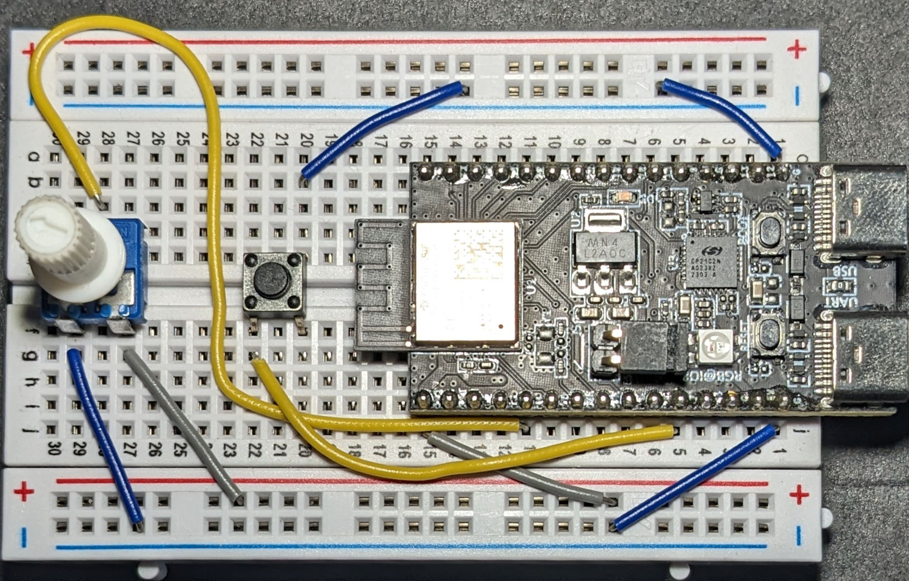

# Matter RGB lamp

This projects builds a Matter enabled RGB lamp.

The purpose of this project is to understand and demonstrate the user experience of the
Rust implementation of Matter (`rs-matter`) and identify pain points for future 
improvement of `rs-matter` and related crates.

This projects uses [nix devenv](https://devenv.sh/) to maintain a reproducible setup.

## Hardware

Care has been taken to support most esp32 MCUs, however, this project has been tested on the following hardware setup.

- **MCU**: esp32-c6, specifically ESP32-C6-DevKitM-1 V1.0
- **Factory reset button**: GPIO9, the *boot* button on the devkit
- **On/Off button**: GPIO7 with pull up
- **Level control potentiometer**: ADC1 GPIO4

### Schematic


_fig 1_: The wiring used for the above mentioned hardware.


## Build and run

### Build

The default features build for `esp32c6`.

```
cargo build --target riscv32imac-unknown-none-elf --release
```

If not building in the Nix devenv, `+nightly` may be required.

### Flash

```
espflash flash target/riscv32imac-unknown-none-elf/release/rgb_lamp_wifi --baud 1500000
```

### Monitor

This is required to get commissioning information from the device.

```
espflash monitor -elf target/riscv32imac-unknown-none-elf/release/rgb_lamp_wifi
```

## Usage of `rs-matter` APIs

`rs-matter` leverages Rust's type system and async runtime to provide safer, more ergonomic APIs compared to the traditional C++ SDK.
The following demonstrate how the [usage patters provided by `rs-matter`](https://github.com/project-chip/rs-matter/blob/main/docs/Matter_clusters-Implementation_usage_and_support.md) translate to cleaner embedded code.

### Single struct, multiple hooks

This project uses three clusters to control the light; OnOff for switching the light on and off, 
LevelControl for adjusting the light brightness and ColorControl for changing the color of the light.

`rs-matter` provides full implementations of the OnOff and LevelControl clusters via pattern C.
This enables us implement device-specific logic via the Hooks traits and get all Matter-specific logic for free.

Hooks traits for different clusters can be implemented by the same structure.
This allows us to consolidate device-specific functionality into one structure.
This pattern can be observed in the [`LedHandler` struct](src/led/led_handler.rs#L31).
The `LedHandler` instance is then passed by reference into the cluster handler constructors.

### Asynchronous hardware integration

Matter-specific logic sometimes defines complex state machines and long-running tasks.
In `rs-matter`, these run asynchronously.
When relevant, Hooks traits provide an `async fn run` method enabling asynchronous device interactions to run alongside Matter state machines.

Additionally, these `run` methods provide a closure allowing users to send out-of-band messages to the Matter state machines.
These messages offer a way to utilise the same Matter-defined logic for non-Matter interactions, be it hardware, vendor app, etc.
This ensures a consistent behaviour across all interactions.

In this project, the [`run`](src/led/led_handler.rs#L112) method provided by the `OnOffHooks` trait is used to wait on the on/off button interrupt and send out-of-band messages to the Matter-defined state machine.
The [`run`](src/led/led_handler.rs#L193) method provided by the `LevelControlHooks` trait is used to monitor potentiometer changes and update the Matter state-machine accordingly.
This ensures that state transition behaviour is consistent irrespective of the interaction method used.

This pattern provides complete and easy-to-use Matter functionality to SDK consumers, equivalent to the functionalities offered to Matter controllers.

### Custom cluster implementation

When `rs-matter` doesn't yet provide a cluster implementation (such as ColorControl), the library's modular design enables straightforward custom implementations.
This project uses pattern A to implement the device-specific logic, omitting Matter-specific logic where not necessary.

The [`import!()`](src/dm/clusters.rs#L3) macro is used to generate all the necessary types and traits.
A [`ColorControlHandler`](src/dm/color_control.rs#L13) is implemented similar to `rs-matter`.

Note: If adopting the same implementation patterns described in [`rs-matter` docs](https://github.com/project-chip/rs-matter/blob/main/docs/Matter_clusters-Implementation_usage_and_support.md), full cluster implementations can be submitted to `rs-matter`.
