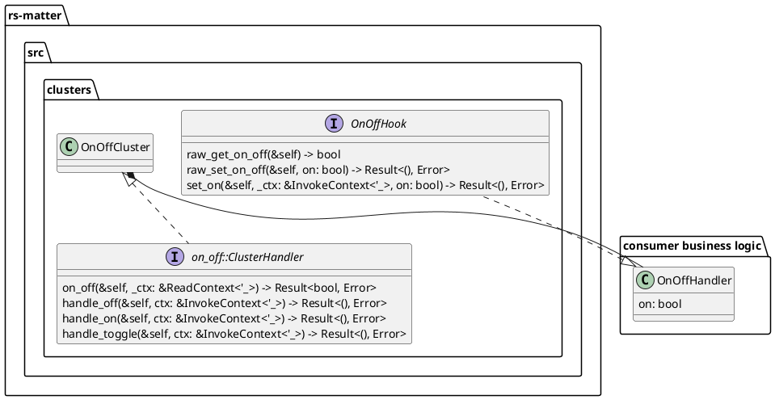

# (WIP) Matter RGB lamp

**NOTE** This project is still very much a playground.

This projects builds a Matter enabled RGB lamp.

The current purpose of this project is to understand the user experience of the 
Rust implementation of Matter (`rs-matter`) and identify pain points for future 
improvement of `rs-matter`. 
The secondary purpose of this project is to build a Matter enabled floor lamp 
for my bedroom.

This projects uses [nix devenv](https://devenv.sh/) to maintain a reproducible setup.

## Helpful commands

### Building

If using the nix devenv setup:
```
cargo build --bin rgb_lamp_wifi --target riscv32imac-unknown-none-elf --no-default-features --features esp32c6
```

Different setups might require `+nighly`.

### Flashing

```
espflash flash target/riscv32imac-unknown-none-elf/debug/rgb_lamp_wifi --baud 1500000
```

### Monitoring

This is required to get commissioning information from the device.

```
espflash monitor -elf target/riscv32imac-unknown-none-elf/debug/rgb_lamp_wifi 
```

## Cluster implementation pattern

Currently, `rs-matter` does not implement clusters according to the Matter spec. 
`rs-matter` provides the types and interfaces for each cluster.
These are macro generated from the Matter IDL.
This is great for keeping `rs-matter` inline with the latest changes to the spec, however, 
this puts substantial effort on users to implement the clusters as outlined in the spec.

The following notes pontificate code patterns that might be used to implement clusters with spec defined logic.
The goal is to provide a simple and safe interface for consumers to add their business logic without bothering with all the Matter specific logic.

### Simple cluster implementation

This UML diagram outlines how the business logic for a cluster can be separated out from the spec logic implementation.
This diagram assumes that SDK consumers are also managing the attributes.
See next section for more information.



### Memory location

It could be argued that it would be simpler for users to have cluster attributes stored within the cluster implementation.
This allows for the cluster implementation to also manage persistence as required by the spec.
Coupling this with a way for the user to read these states whenever required would make for a very simple design.

However, following on from learnings in implementing the c++ SDK, there will be cases where it would be preferred for the user to manage this memory.
For example, having attributes that store slices of large structs; ServiceArea, ModeBase.
Hence, it may be good to explore patterns where users can take control of these states.

One pattern is to add raw accessor methods to the hook traits, allowing the SDK cluster impl to manipulate this information as required.
If we only allow for interior mutability of the hook traits, all hook traits can be implemented for one "driver" struct that stores all the states in one place.
This can then be passed by reference the the cluster structs.


### Base and derived clusters

todo

